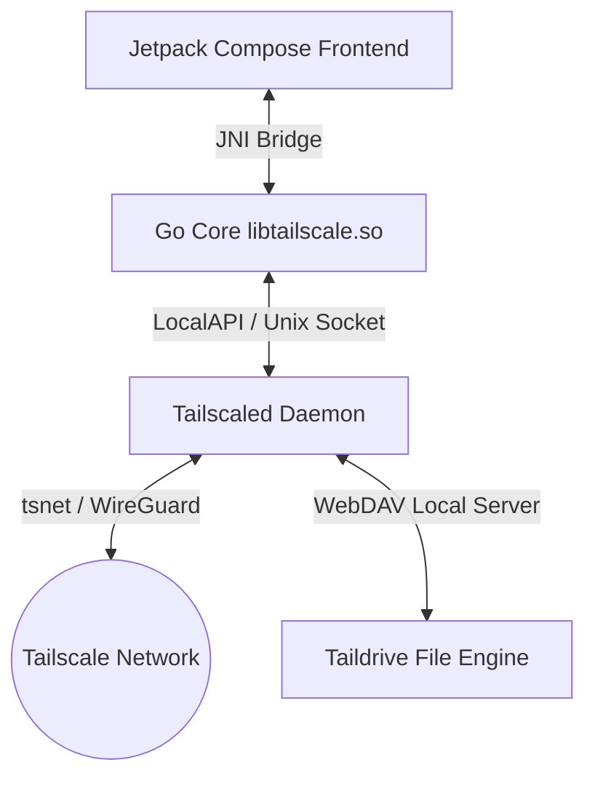

# TailSocks

  

  <strong>Advanced Tailscale Client for Android with Userspace Networking</strong>

  
  
  

---

> this is a temporary version of the readme written by ai, later I will update it in more detail, as well as write a wiki. 

TailSocks is a high-performance, lightweight Android client for [Tailscale](https://tailscale.com/) that operates exclusively in **userspace-networking mode** (via `tsnet`). 
 It provides a complete Tailscale environment—including Taildrop, Exit Nodes, and Serve/Funnel—without utilizing Android's `VpnService` permission, enabling seamless coexistence with other VPN and firewall applications.

---

## ✨ Key Features

### 🔌 1. Native LocalAPI Architecture
* **CLI-less Sovereignty:** Complete Tailscale daemon management directly via the Unix socket (`tailscaled.sock`) using LocalAPI v0.
* **Account Isolation:** Switch between multiple profiles with strictly separated credentials, keypairs, and states stored inside isolated folders.

### 🛡️ 2. SOCKS5, DNS & Control Plane Proxy
* **Control Plane Tunneling:** Route Control Plane traffic through a custom HTTP/SOCKS5 proxy, enabling connection to Tailscale in regions where the service is blocked or restricted.
* **Coexistence-Friendly:** Seamlessly runs alongside system-wide adblockers (e.g., AdGuard) or other active VPN clients.
* **DNS Wrapping:** Routes MagicDNS and Split DNS queries over an internal TCP proxy wrapper through the SOCKS5 tunnel.

### 🌐 3. Tailscale Serve & Funnel Overlays
* **In-App Proxy Control:** Expose local ports and services securely to your private Tailnet or the public internet with a native UI.
* **Reset-then-Apply State:** Employs clean config updates on every synchronization to prevent policy desyncs.

### 🚀 4. Taildrop Hub & System Share Sheet
* **File Sharing Hub:** Receive, preview, and organize incoming files locally.
* **Direct Send via Share Sheet:** Share files directly from any system file manager or third-party apps using the native Android Share menu (available on devices without TAG restrictions).

### 📂 5. Taildrive (WebDAV Shared Folders)
* **Built-in WebDAV Server:** Share local device directories with your entire Tailnet using Tailscale's standard drive integration.
* **Storage Access Framework:** Integrate physical path mappings for Storage Access Framework (SAF) folder selections.
* **Seamless Cross-Platform Compatibility:** Features path case-insensitivity fixes to ensure stable operation when mounting shares from Windows, macOS, or Linux clients.

### 📦 6. Exit Node Routing & Settings Backups
* **Exit Nodes:** Route all your internet traffic through any authorized peer on your Tailnet with auto-healing and LAN access support.
* **Full App State Backups:** Export and import settings, profiles, and SOCKS5 parameters in secure ZIP/JSON archives for seamless data portability.

---

## 📸 Screenshots

<table width="100%">
  <tr>
    <td width="33%" align="center">
      <strong>Main Dashboard</strong> 
      
    </td>
    <td width="33%" align="center">
      <strong>Account Switch</strong> 
      
    </td>
    <td width="33%" align="center">
      <strong>Peers</strong> 
      
    </td>
  </tr>
  <tr>
    <td width="33%" align="center">
      <strong>Logs</strong> 

    </td>
    <td width="33%" align="center">
      <strong>Taildrop</strong> 

    </td>
    <td width="33%" align="center">
      <strong>Taildrive Shares</strong> 

    </td>
  </tr>
  <tr>
    <td width="33%" align="center">
      <strong>DNS</strong> 

    </td>
    <td width="33%" align="center">
      <strong>Settings (App)</strong> 

    </td>
    <td width="33%" align="center">
      <strong>Settings(Profile)</strong> 

    </td>
  </tr>
  <tr>
    <td width="33%" align="center">
      <strong>Network Diagnostics</strong> 

    </td>
    <td width="33%" align="center">
      <strong>Serve & Funnel</strong> 

    </td>
    <td width="33%" align="center">
      <strong>Send to... (TailDrop)</strong> 

    </td>
  </tr>
</table>

---

## 🏗️ System Architecture

TailSocks is built as a hybrid high-performance platform:
1. **Tailscale Core:** A tailored Go environment compiled as a shared library (`libtailscale.so`) via `appctr/build.sh`.
2. **JNI / Go Bridge (`appctr`):** A high-speed `gomobile` bridge that handles IPC, status streams, and local loopbacks.
3. **Jetpack Compose UI:** A compact, high-density dashboard and sub-activities optimized for one-handed operation.

---

## 📚 Documentation

* [**Architecture Deep Dive**](docs/ARCHITECTURE.md) — Technical details on DNS wrapping and account isolation.
* [**Build Instructions**](docs/BUILDING.md) — Setting up the NDK environment and compiling the Go core.
* [**Project Evolution**](docs/RETROSPECTIVE.md) — History of the project from PoC to the current stable architecture.
* [**AdGuard Setup**](docs/ADGUARD.md) — Instructions for using TailSocks alongside system-wide ad-blockers.
* [**Serve & Funnel Guide**](docs/SERVE_FUNNEL_GUIDE.md) — How to expose local ports and virtual services.
* [**Roadmap**](docs/ROADMAP.md) — Planned features and short-term goals.

---

## 🤝 Credits & Acknowledgements

This project would not be possible without the excellent work of the following developers and projects:

* **App Developer:** [Bropines](https://github.com/bropines)
* **Patch Developer:** [Asutorufa](https://github.com/Asutorufa) for the essential Android [tailscale patches](https://github.com/Asutorufa/tailscale).
* **Core Network Engine:** [Tailscale Inc.](https://github.com/tailscale/tailscale) for their incredible userspace core engine (`tsnet`).
* **Google and Gemini** [Gemini](https://gemini.google.com/) helped me a lot in developing the interface and reading the LocalAPI. And yes, this project was written with the help of AI

---

## 📜 License

Distributed under the BSD-3-Clause License. See `LICENSE` for details.

*Note: This project is an independent open-source contribution and is not affiliated with Tailscale Inc.*
