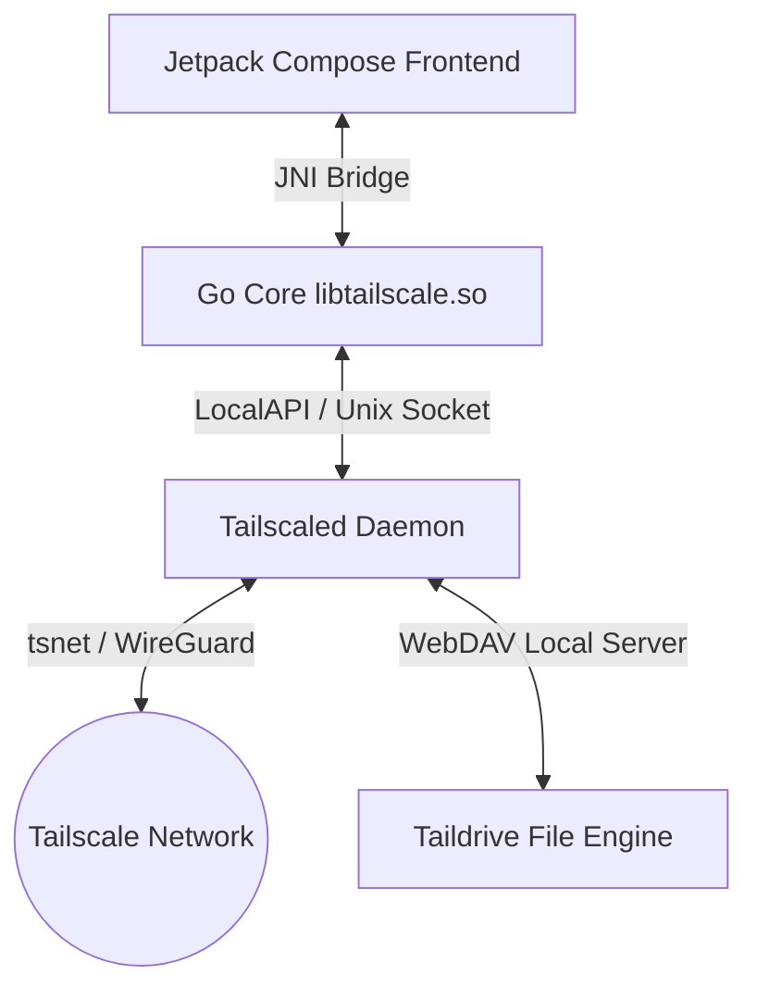

# TailSocks

  

  <strong>Advanced Tailscale Client for Android with Userspace Networking</strong>

  
  
  

---

TailSocks is a high-performance, lightweight Android client for [Tailscale](https://tailscale.com/) that operates exclusively in **userspace-networking mode** (via `tsnet`). It provides a complete Tailscale environment—including Taildrop, Exit Nodes, and Serve/Funnel—without utilizing Android's `VpnService` permission, enabling seamless coexistence with other VPN and firewall applications.

---

## ✨ Key Features

### 📂 1. Taildrive (WebDAV Shared Folders) [New]
* **Built-in WebDAV Server:** Share local device folders with your entire Tailnet directly using Tailscale's standard drive integration.
* **Storage Access Framework:** Integrate physical path mappings for Storage Access Framework (SAF) folder selections.
* **Seamless Cross-Platform Compatibility:** Fixed path case-sensitivity issues, ensuring flawless operation when mounting shares from Windows, macOS, or Linux.
* **Granular Control:** Easy-to-use directory management interface with full path validation and permission handling (`MANAGE_EXTERNAL_STORAGE`).

### 🎨 2. Redesigned Settings & Reactive Theme Engine [New]
* **Tabbed Categorization:** The settings interface is split into four clean, swipeable tabs (Style, Network, Core, Profile) to eliminate long vertical scrolling.
* **Custom Theme Engine:** Native support for System, Light, Dark, and **AMOLED** (pure black `#000000` background for optimal battery efficiency).
* **7 Color Presets:** Instantly toggle between pre-configured styles: Default (Material 3), Lavender, Emerald, Sapphire, Amber, Monochrome, and a sleek **TokioNight** palette.
* **Fully Reactive Theme Synced:** Live visual theme switches propagate instantly across all active screens in real-time, without forcing activity restarts.
* **Material You:** Full support for dynamic color customization on Android 12+ devices.

### 🔌 3. Native LocalAPI Architecture
* **CLI-less Sovereignty:** TailSocks manages the Tailscale engine entirely via the Unix socket (`tailscaled.sock`) using LocalAPI v0.
* **Account Isolation:** Multi-account profile separation, saving profile configurations in independent states under `files/states/{id}/`.

### 🌐 4. Serve & Funnel Overlays
* **In-App Proxy Control:** Expose local web applications or services to your private Tailnet or the public internet with native rules.
* **Reset-then-Apply:** Guaranteed stateless configuration state on every update to prevent policy synchronization desyncs.

### 🛡️ 5. SOCKS5 & DNS Wrappers
* **Coexistence-Friendly:** Operates cleanly alongside system-wide adblockers (e.g. AdGuard) or external wireguard clients.
* **DNS Wrapping:** Resolves MagicDNS and Split DNS queries via an internal DNS-over-TCP proxy wrapper (port 1053) that routes queries through a SOCKS5 tunnel.

---

## 📸 Screenshots

<table width="100%">
  <tr>
    <td width="33%" align="center">
      <strong>Main Dashboard</strong> 
      
    </td>
    <td width="33%" align="center">
      <strong>Settings (Style Tab)</strong> 
      
    </td>
    <td width="33%" align="center">
      <strong>Settings (Network Tab)</strong> 
      
    </td>
  </tr>
  <tr>
    <td width="33%" align="center">
      <strong>Settings (Core Tab)</strong> 
      
    </td>
    <td width="33%" align="center">
      <strong>Settings (Profile Tab)</strong> 
      
    </td>
    <td width="33%" align="center">
      <strong>Taildrive Shares</strong> 
      
    </td>
  </tr>
  <tr>
    <td width="33%" align="center">
      <strong>Serve & Funnel</strong> 
      
    </td>
    <td width="33%" align="center">
      <strong>Taildrop Hub</strong> 
      
    </td>
    <td width="33%" align="center">
      <strong>Peers List</strong> 
      
    </td>
  </tr>
  <tr>
    <td width="33%" align="center">
      <strong>Network Diagnostics</strong> 
      
    </td>
    <td width="33%" align="center">
      <strong>System Logs</strong> 
      
    </td>
    <td width="33%" align="center">
      <strong>Widgets Showcase</strong> 
      
    </td>
  </tr>
</table>

---

## 🏗️ System Architecture

TailSocks is built as a hybrid high-performance platform:
1. **Tailscale Core:** A tailored Go environment compiled as a shared library (`libtailscale.so`) via `appctr/build.sh`.
2. **JNI / Go Bridge (`appctr`):** A high-speed `gomobile` bridge that handles IPC, status streams, and local loopbacks.
3. **Jetpack Compose UI:** A compact, high-density dashboard and sub-activities optimized for one-handed operation.

---

## 📚 Documentation

* [**Architecture Deep Dive**](docs/ARCHITECTURE.md) — Technical details on DNS wrapping and account isolation.
* [**Build Instructions**](docs/BUILDING.md) — Setting up the NDK environment and compiling the Go core.
* [**Project Evolution**](docs/RETROSPECTIVE.md) — History of the project from PoC to the current stable architecture.
* [**AdGuard Setup**](docs/ADGUARD.md) — Instructions for using TailSocks alongside system-wide ad-blockers.
* [**Serve & Funnel Guide**](docs/SERVE_FUNNEL_GUIDE.md) — How to expose local ports and virtual services.
* [**Roadmap**](docs/ROADMAP.md) — Planned features and short-term goals.

---

## 🤝 Credits & Acknowledgements

This project would not be possible without the excellent work of the following developers and projects:

* **App Developer:** [Bropines](https://github.com/bropines)
* **Patch Developer:** [Asutorufa](https://github.com/Asutorufa) for the essential Android [tailscale patches](https://github.com/Asutorufa/tailscale).
* **Core Network Engine:** [Tailscale Inc.](https://github.com/tailscale/tailscale) for their incredible userspace core engine (`tsnet`).
* **Google and Gemini** [Gemini](https://gemini.google.com/) helped me a lot in developing the interface and reading the LocalAPI. And yes, this project was written with the help of AI

---

## 📜 License

Distributed under the BSD-3-Clause License. See `LICENSE` for details.

*Note: This project is an independent open-source contribution and is not affiliated with Tailscale Inc.*
