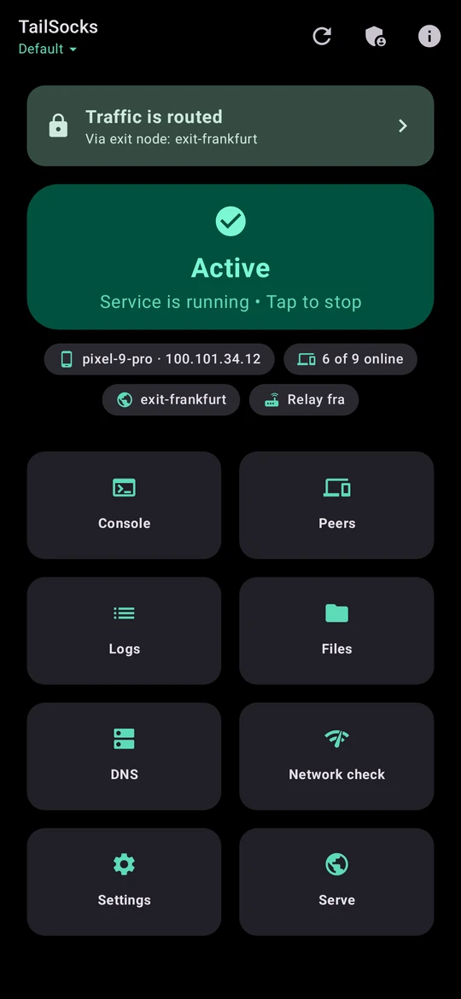
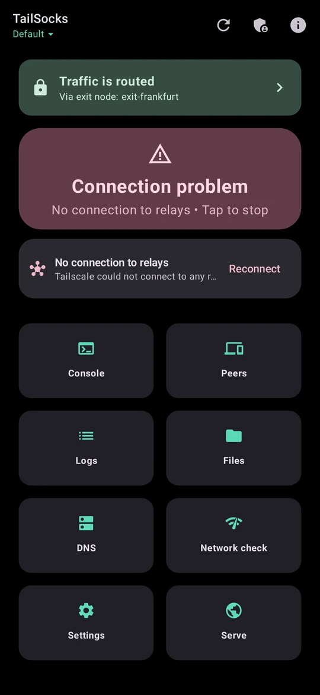
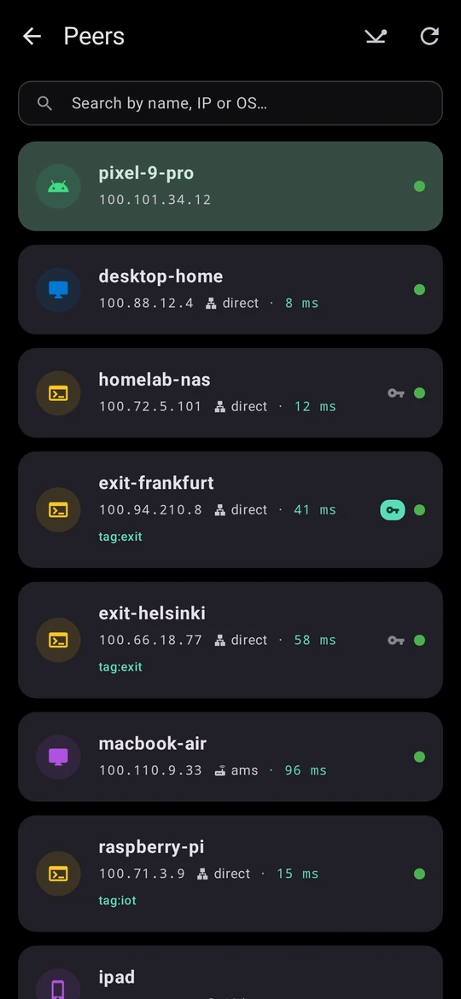
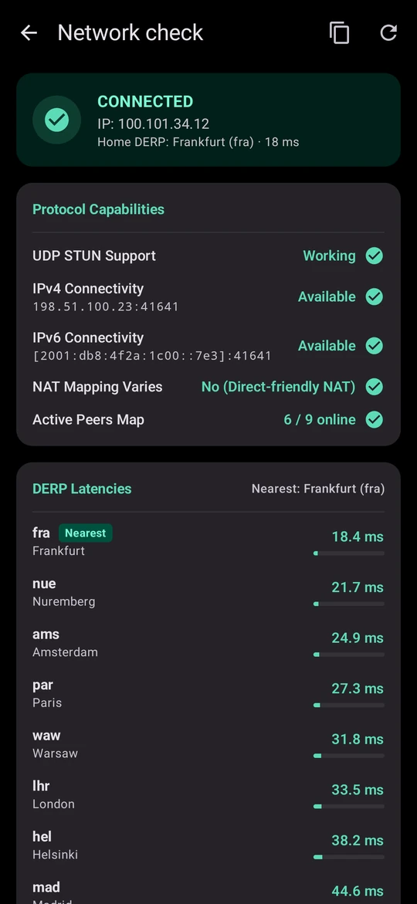
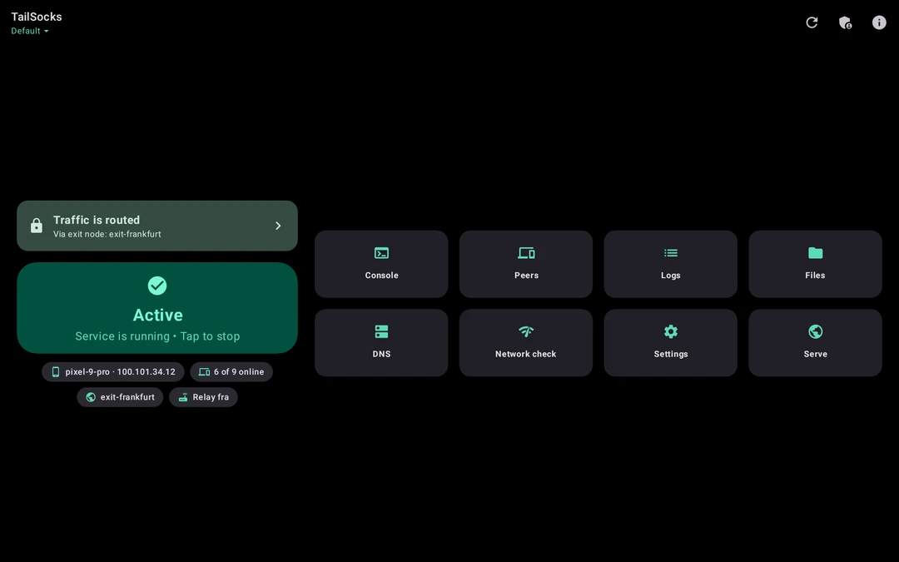

<p align="center">
  
</p>

<h1 align="center">TailSocks</h1>

<p align="center">
  <strong>Unofficial Tailscale client for Android — a proxy, a VPN, or root routing</strong>
</p>

<p align="center">
  <strong>English</strong> | <a href="readme_ru.md">Русский</a>
</p>

<p align="center">
  <a href="https://github.com/bropines/tailsocks/releases/latest"></a>
  <a href="https://github.com/bropines/tailsocks/releases"></a>
  <a href="https://github.com/tailscale/tailscale/releases/tag/v1.102.5"></a>
  <a href="LICENSE"></a>
</p>

<p align="center">
  <a href="https://github.com/bropines/tailsocks/releases/latest">
    
  </a>
  &nbsp;
  <a href="https://apps.obtainium.imranr.dev/redirect?r=obtainium://add/https://github.com/bropines/tailsocks">
    
  </a>
  &nbsp;
  <a href="https://boosty.to/pinus">
    
  </a>
  &nbsp;
  <a href="https://github.com/bropines/tailsocks/releases">
    
  </a>
</p>

<p align="center">
  
</p>

---

TailSocks runs a full [Tailscale](https://tailscale.com/) node on your Android phone and lets you choose how it reaches the rest of the device: as a **local SOCKS5/HTTP proxy** that needs no VPN permission and coexists with any other VPN, as a **system-wide VPN** (TUN, split or full tunnel), or — on rooted devices — through a **real kernel interface** with policy routing. Everything Tailscale offers is there: [exit nodes](https://tailscale.com/kb/1103/exit-nodes), [MagicDNS](https://tailscale.com/kb/1081/magicdns), [Taildrop™](https://tailscale.com/kb/1106/taildrop), [Taildrive™](https://tailscale.com/kb/1369/taildrive), [Serve & Funnel](https://tailscale.com/kb/1242/tailscale-serve), several accounts, Headscale, and a built-in DPI bypass for the control plane where Tailscale is blocked.

It tells you what is actually going on: whether the tailnet is connected, still connecting or cut off from its relays, which of your devices are reachable directly and which only through a relay — and offers the one action that helps.

---

## ✨ Features

### Networking & Connectivity

| Feature | Description |
|---------|-------------|
| **Native LocalAPI** | 100% CLI-less daemon management via Unix socket (`tailscaled.sock`) using LocalAPI v0. No shell commands. |
| **SOCKS5 Proxy** | Built-in local SOCKS5 proxy server with optional authentication for per-app routing. |
| **LAN Access** | One switch (Settings → Local proxies → **Expose proxies to local network**) binds the SOCKS5 proxy, HTTP proxy and local DNS to `0.0.0.0` so other devices on your Wi-Fi can route through your tailnet. The app shows the address to connect to and warns when the SOCKS5 proxy has no password — without one, anyone on the LAN can use it. |
| **Root Mode (experimental)** | On rooted devices the daemon runs as root with a real `tailscale0` kernel interface, policy routing in table `53` via dedicated `TAILSOCKS_MARK`/`TAILSOCKS_DNS` iptables chains, per-app exclusions, an optional system-wide DNS redirect that is armed only while MagicDNS answers, a *Check Routing* diagnostics button and a ROOT log tab. When another VPN app holds Android's VPN slot, Root Mode steps aside — keeping the tailnet reachable while leaving that client its apps and its resolver — or carries only the apps that client bypasses; an override takes the device anyway. After a reboot the boot script installs tailnet reachability alone: the exit node and device-wide MagicDNS arrive when the app next runs. See the [Root guide](docs/ROOT.md). |
| **Control Plane Proxy** | Route coordination server traffic through a custom SOCKS5/HTTP proxy for restricted regions. |
| **TUN VPN Mode** | Transparent system-wide VPN via native `hev-socks5-tunnel` — full tunnel & split tunnel, per-app exclusions, custom gateway IP. Tailnet IPv6 always rides the tunnel; routing the public IPv6 internet through it is opt-in, since an exit node that cannot carry v6 leaves those sites hanging. Enabling TUN asks first, because Android gives the VPN slot to one app at a time. |
| **[Exit Nodes](https://tailscale.com/kb/1103/exit-nodes) ©** | Route all internet traffic through any authorized Tailscale peer with auto-healing and LAN access. |
| **[MagicDNS](https://tailscale.com/kb/1081/magicdns) ©** | In-memory peer resolution (0ms), Split DNS over SOCKS5 TCP, smart upstream fallback with DoH support. |
| **NAT Traversal** | Real-time `InMagicSock` connectivity monitoring. STUN/DERP diagnostics via native netcheck. |

### Services & File Sharing

| Feature | Description |
|---------|-------------|
| **[Tailscale Serve & Funnel](https://tailscale.com/kb/1242/tailscale-serve) ©** | Expose local ports to your Tailnet or the public internet. TCP & HTTPS modes, TLS certificate export. |
| **[Tailscale Services (`svc:`)](https://tailscale.com/kb/1438/virtual-ip) ©** | Create named virtual services with dedicated VIPs and DNS names, managed from native UI. |
| **[Taildrop™](https://tailscale.com/kb/1106/taildrop) ©** | Send & receive files between Tailnet devices. Inbox hub, system Share Sheet integration, DocumentsProvider. |
| **[Taildrive™](https://tailscale.com/kb/1369/taildrive) ©** | Share local folders over WebDAV. SAF integration, remote share mounting, SOCKS5-proxied access. Cross-platform path case-insensitivity fixes. |

### Management & Administration

| Feature | Description |
|---------|-------------|
| **Multi-Account Isolation** | Strict per-profile data separation — independent state dirs, preferences, keypairs, and Taildrop folders. |
| **Tailscale Admin API** | Full `api.tailscale.com/v2` integration — manage devices, DNS, users, services, webhooks, ACLs, and audit logs. |
| **Biometric Lock** | Admin Console protected by fingerprint/face authentication. |
| **Auth Keys** | Generate, view, and revoke authentication keys from inside the app. |
| **Data Portability** | Full encrypted app state backups (ZIP) and individual account exports (JSON, including the app-wide settings but never the automation secret, the API token or the node keys). Backups record the app version and format that produced them; an older app refuses to restore an archive made by a newer version instead of corrupting the profile (backups from older versions still restore). |
| **Automation** | Token-protected Broadcast Intents for Tasker/MacroDroid/ADB and 14 AppFunctions for on-device assistants (Gemini, Android 16+). See the [Automation guide](docs/AUTOMATION.md). |

### User Experience

| Feature | Description |
|---------|-------------|
| **Honest Dashboard** | A status card with six states — stopped, starting, connecting, connected, a connection problem, sign-in needed — a banner naming what is wrong with a one-tap fix (reconnect the relays, open the DPI bypass), and a summary of the tailnet: this device, how many peers are online, the exit node by name, the home relay. |
| **Adaptive Layout** | Two panes wherever there is room — landscape, tablets, foldables (laid out around the hinge, including the half-open tabletop posture); lists and forms hold a readable width on large screens. |
| **Material 3 Theming** | System, Light, Dark, AMOLED Black modes. 7 color presets + Material You dynamic colors. |
| **Localization** | English and Russian, as standard Android string resources. |
| **Home Screen Widgets** | Jetpack Glance widgets — Service Toggle, Exit Node, Stats Dashboard, Serve status. |
| **Quick Settings Tile** | System Quick Settings tile with active profile display and account switching. |
| **Network Diagnostics** | Native netcheck with DERP latency visualization, NAT type detection, and public IP reporting. |
| **Background Reliability** | Optional auto-reconnect with an attempt limit, a 15-minute watchdog that revives a service killed in the background, and a session-long wake lock (*Keep the connection awake*, which also decides whether the service starts after a reboot). A manual Stop is always final. See [Background behaviour](#-background-behaviour). |

---

## 📸 Screenshots

<table>
  <tr>
    <td width="25%" align="center"><br/><sub>Connected, with a summary of the tailnet</sub></td>
    <td width="25%" align="center"><br/><sub>What is wrong, and the one action that helps</sub></td>
    <td width="25%" align="center"><br/><sub>Peers, pinged all at once</sub></td>
    <td width="25%" align="center"><br/><sub>Home relay and DERP latencies</sub></td>
  </tr>
  <tr>
    <td colspan="2" align="center"><br/><sub>Settings side by side on a wide screen</sub></td>
    <td colspan="2" align="center"><br/><sub>Tablets and foldables get two panes</sub></td>
  </tr>
</table>

<sub>Rendered from an invented tailnet by the app's own preview tests — see <a href="scripts/readme_shots.py"><code>scripts/readme_shots.py</code></a>.</sub>

---

## 🏗️ Architecture

TailSocks is built as a hybrid multi-layer system:

```
┌─────────────────────────────────────────────────────────────────┐
│                    Jetpack Compose UI (Kotlin)                  │
│  Dashboard · Peers · Logs · DNS · Netcheck · Serve · Settings   │
│  Admin API Console · Taildrive · Taildrop · TUN Config          │
├─────────────────────────────────────────────────────────────────┤
│                   JNI / Gomobile Bridge (appctr)                │
│  LocalAPI Client · DNS Proxy · IPN Bus · Netcheck · Taildrop    │
├─────────────────────────────────────────────────────────────────┤
│              Tailscale Daemon (libtailscale.so)                 │
│  tsnet · WireGuard · magicsock · DERP · Serve/Funnel · Drive    │
├───────────────────────┬─────────────────────────────────────────┤
│   SOCKS5 Proxy Mode   │       TUN VPN Mode (optional)           │
│  Per-app proxying via │   System-wide routing via native        │
│  local SOCKS5 server  │   hev-socks5-tunnel (C library)         │
│  (no VpnService)      │   Full/Split tunnel + app exclusions    │
└───────────────────────┴─────────────────────────────────────────┘
```

### Core Components

| Layer | Technology | Purpose |
|-------|-----------|---------|
| **Daemon** | Go → `libtailscale.so` (PIE) | Patched Tailscale core compiled with aggressive build tags to strip desktop/enterprise features. Targets `arm64`, `arm`, `x86`, `x86_64`. |
| **Bridge** | Go → `appctr.aar` (Gomobile) | High-speed JNI bridge handling LocalAPI calls, DNS proxying, IPN bus monitoring, netcheck, Taildrop, and Taildrive WebDAV. |
| **App** | Kotlin + Jetpack Compose | Material 3 UI, foreground service lifecycle, Android system integrations (SAF, Widgets, Quick Settings, Share Sheet). |
| **TUN Engine** | C → `hev-socks5-tunnel` | Optional transparent VPN interface. Routes traffic through the SOCKS5 proxy at kernel level. Per-app and per-IP exclusions. |

### Key Design Patterns

- **Stateless Configuration:** Every config update is explicit. Serve/Funnel uses a "Reset-then-Apply" pattern (POST `{}` → POST new config) to prevent stale daemon state.
- **Passive Daemon Management:** No aggressive polling loops. The daemon manages its own lifecycle, policy sync, and reconnection.
- **Account Isolation:** State in `files/states/{id}/`, preferences in `appctr_{id}`. Full daemon restart on profile switch.
- **DNS Wrapping:** MagicDNS resolved from in-memory node cache. Split DNS wrapped as TCP-over-SOCKS5. Fallback chain: SOCKS5 UDP → Direct UDP → DoH.
- **410 Wall Mitigation:** Configuration updates are blocked while a Login URL is active to protect authentication sessions.

### Upstream Patches

TailSocks maintains 20 minimal atomic patches in [`appctr/patches/`](appctr/patches/) to inject capabilities not exposed via LocalAPI:

| Patch | Purpose |
|-------|---------|
| `01-enable-socks-android` | Enable SOCKS5 support in userspace-networking on Android |
| `02-socks5-auth` | Add username/password fields to the outbound SOCKS5 listener |
| `03-taildrop-monolithic-fs` | Pure-Go `fsFileOps` to avoid JNI panics in Taildrop |
| `04-vip-services` | Append VIP services to `HostInfo` for coordination server visibility |
| `05-localapi-cert` | Enable `/cert` endpoint compilation on Android |
| `06-android-netmon` | Custom `netmon.InterfaceGetter` for Android 10+ `netlink` restrictions; the Hostinfo masquerade (`OS = linux` by default, the real device with *Report the real OS*) |
| `07-taildrive-android` | Android-specific Taildrive adaptations |
| `08-netstack-cgnat` | CGNAT routing fix for netstack |
| `09-netstack-loopback` | Loopback routing for self-addressed packets in netstack |
| `10-taildrive-userspace-dial` | Route remote peer WebDAV via `tsdial.Dialer` |
| `11-noop-dns-fallback` | DNS fallback env var injection for SERVFAIL prevention |
| `12-socket-permissions` | `tailscaled` creates its socket world-readable, without an external `chmod` loop |
| `13-android-osrouter` | Android kernel-TUN router: manage addresses and routes only, leave iptables to the app |
| `14-dns-forwarder-netstack` | Dial tailnet resolvers through netstack, and rescue a query the exit node refuses |
| `15-dnscache-static-hosts` | Honour `TS_STATIC_HOSTS` so a control proxy behind a hostname resolves |
| `16-android-somark` | Mark the root daemon's own sockets so another VPN client cannot swallow them |
| `17-android-tunfd-probe` | A probe that hands a duplicate of the VPN's TUN descriptor to a child daemon to see what it can do with it |
| `18-android-vpn-tun` | `--tun=android-vpn`: the daemon runs the tunnel on the descriptor Android's VpnService opened (the native TUN engine) |
| `19-android-vpn-netstack` | In that mode, dial peers through netstack and claim replies to the daemon's own flows |
| `20-socks5-resilience` | Keep the served SOCKS5 proxy up: back off on accept errors, bound the handshake, ride out a relay reconnect |

---

## 🚀 Getting Started

### Download

Grab the latest APK from the [Releases](https://github.com/bropines/tailsocks/releases/latest) page, or use the download buttons at the top of this README.

> **Supported architectures:** `arm64-v8a`, `armeabi-v7a`, `x86`, `x86_64`  
> **Minimum Android version:** 7.0 (API 24)

### Build from Source

<details>
<summary><strong>Build instructions</strong></summary>

**Prerequisites:**
- Android NDK (set `ANDROID_NDK_HOME`)
- Go — no specific version to install; the build sets `GOTOOLCHAIN=auto` and fetches the exact Go toolchain the module requires
- `gomobile` (`go install golang.org/x/mobile/cmd/gomobile@latest && gomobile init`)
- Android SDK with Gradle

**1. Clone:**
```bash
git clone --recurse-submodules https://github.com/bropines/tailsocks.git
cd tailsocks
```

**2. Compile Go core** (downloads the Tailscale source pinned in `appctr/TAILSCALE_VERSION`, patches, and cross-compiles):
```bash
cd appctr
bash build.sh
cd ..
```

**3. Build APK:**
```bash
# Debug build (installs alongside the release app as *.dev, no keystore needed)
./gradlew app:assembleDebug

# Release build — requires your own keystore; the build refuses to sign with the debug key
KEYSTORE_FILE="$PWD/tailsocks.jks" KEYSTORE_PASSWORD=... \
KEY_ALIAS=... KEY_PASSWORD=... ./gradlew app:assembleRelease
```

> The build script automatically downloads the correct Tailscale version, applies all patches, and compiles PIE binaries for 4 architectures. No fork maintenance required.
>
> Release builds are R8-minified with resource shrinking, and the `verifyReleaseNativeMethods` task fails the build if R8 ever drops a JNI method the TUN library needs. Details in [Build Instructions](docs/BUILDING.md).

</details>

---

## 📚 Documentation

| Document | Description |
|----------|-------------|
| [Architecture Deep Dive](docs/ARCHITECTURE.md) | DNS wrapping, account isolation, netcheck, and patch analysis |
| [Build Instructions](docs/BUILDING.md) | NDK setup, Go core compilation, dynamic patch pipeline |
| [Project Retrospective](docs/RETROSPECTIVE.md) | Evolution from PoC to the current architecture |
| [AdGuard Setup](docs/ADGUARD.md) | Coexistence with system-wide ad blockers |
| [Serve & Funnel Guide](docs/SERVE_FUNNEL_GUIDE.md) | Exposing local ports and virtual services |
| [Root Integration & Service Guide](docs/ROOT.md) | System-wide root autostart daemon, the routing and DNS rules it installs, living next to another VPN client, service.d, and the CLI wrapper |
| [Tasker & Automation Guide](docs/AUTOMATION.md) | Intent automation setup for Tasker, MacroDroid, Automate, and ADB |
| [Roadmap](docs/ROADMAP.md) | Planned features and short-term goals |
| [Contributing](CONTRIBUTING.md) | Build, patch and commit rules for your first pull request |
| [Changelog](CHANGELOG.md) | Full version history |

## 🌐 Restricted Regions & DPI Bypass

For users in restricted regions (e.g., where `controlplane.tailscale.com` is blocked/dropped), TailSocks offers an in-app bypass mechanism for the control plane:

### 1. Control Plane DPI Bypass (ByeDPI JNI)
TailSocks bundles a native JNI implementation of [ByeDPI](https://github.com/hufrea/byedpi) directly inside the app process. This allows bypassing SNI-based deep packet inspection (DPI) without spawning external binary processes.
* **Security:** ByeDPI binds strictly to a randomized loopback IP (e.g., `127.182.201.43`) and a randomized port in the `127.0.0.0/8` subnet upon every startup. This prevents other applications on the device from discovering or connecting to the proxy via simple port scanning.
* **Usage:** Enable **DPI Bypass (ByeDPI)** in Settings → Censorship bypass and configure custom ByeDPI flags (default: `-s 1 -d split -r`).

---

## ⚡ Tasker & Automation Integration

TailSocks supports background control via **Android Broadcast Intents**. You can automate connections using Tasker, MacroDroid, Automate, or `adb`.

**A secret token is required.** Set one under **Settings → Automation & API** (there is a *Generate* button) and pass it with every intent as the string extra `secret` (`token` and `key` are accepted too). Since 4.0.0 the receiver ignores every intent until a token is configured, so no other app on the device can stop your VPN or reroute traffic.

* **Target Receiver:** `io.github.bropines.tailscaled/.core.TaskerReceiver` (package `io.github.bropines.tailscaled`)
* **Supported Actions** (each also has a short alias, e.g. `io.github.bropines.tailscaled.START`):
  * `io.github.bropines.tailscaled.action.CONNECT` / `DISCONNECT` / `TOGGLE` / `RESTART` — control the connection
  * `io.github.bropines.tailscaled.action.GET_STATUS` — refreshes the widgets/tile state (the `STATUS_CHANGED` broadcast is not visible to other apps)
  * `io.github.bropines.tailscaled.action.SET_EXIT_NODE` — extra `exit_node` (IP, or `none` to clear)
  * `io.github.bropines.tailscaled.action.SWITCH_ACCOUNT` — extra `account` (profile name or ID)
  * `io.github.bropines.tailscaled.action.SET_BYEDPI` — extras `enabled` (boolean), `flags` (string)
  * `io.github.bropines.tailscaled.action.SET_TUN` — extra `enabled` (boolean)

#### ADB example
```bash
adb shell am broadcast -a io.github.bropines.tailscaled.action.DISCONNECT -n io.github.bropines.tailscaled/.core.TaskerReceiver --es secret YOUR_TOKEN
```

#### Tasker Configuration Example:
1. Action: **System** → **Send Intent**
2. Action: `io.github.bropines.tailscaled.action.CONNECT`
3. Target: **Broadcast Receiver**
4. Package: `io.github.bropines.tailscaled`, Class: `io.github.bropines.tailscaled.core.TaskerReceiver`
5. Extra: `secret:YOUR_TOKEN`

Full reference — every action, its extras, the status broadcast, and the AppFunctions list — in the [Tasker & Automation Guide](docs/AUTOMATION.md).

### 🤖 Gemini / AppFunctions (Android 16+)

On Android 16 and newer TailSocks exposes **14 AppFunctions** to on-device assistants: `getStatus`, `getAvailableExitNodes`, `getTailnetPeers`, `getAccounts`, `connect`, `disconnect`, `toggle`, `selectExitNode`, `clearExitNode`, `switchAccount`, `setByeDpi`, `setTunMode`, `setAllowLanAccess`, `setMagicDns`. Every function that changes state obeys the *Allow External Automation* switch; the read-only ones always answer.

---

## 🔄 Background behaviour

* **Auto-reconnect** (Settings → Background & permissions, off by default) restarts the daemon when the connection does not come up or drops, with a configurable attempt limit. Waiting for you to sign in is not treated as a failure.
* **Revive service in background** (same place, on by default) checks every 15 minutes that the service is still alive and starts it again after a background kill. Allowing "Alarms & reminders" (offered when you turn the switch on) lets the check start the service from the background; without it the check still runs, just later. If your ROM refuses the start anyway, you get a notification that reconnects in one tap, and the app tells you once where the autostart permission is.
* **Keep the connection awake** (Settings → Background & permissions, off by default) holds a wake lock for the whole session so the connection survives deep sleep, and is also what starts the service again after a reboot. Costs battery. In Root Mode it decides how long the device waits for its exit node and system-wide MagicDNS after a restart: with it off, they arrive only when you next open the app.
* **A manual Stop is final.** Stopping from the app, notification, Quick Settings tile, a `DISCONNECT` intent or the `disconnect` AppFunction clears the desired state first; neither the watchdog, auto-reconnect nor Android's sticky restart bring the service back until you start it again.
* **Swiping the app away keeps the connection.** Removing the task from Recents does not stop the service.

---

## 🤝 Credits & Acknowledgements

| | |
|-|-|
| **App & Patches** | [Bropines](https://github.com/bropines) — app development, architecture, and the majority of upstream patches |
| **Initial Android Patches** | [Asutorufa](https://github.com/Asutorufa) — original Android networking (`anet`) and network monitor (`netmon`) [patches](https://github.com/Asutorufa/tailscale) that served as a starting point |
| **DPI Bypass** | [hufrea/byedpi](https://github.com/hufrea/byedpi) — local HTTP/SOCKS5 DPI bypass utility |
| **TUN Engine** | [heiher/hev-socks5-tunnel](https://github.com/heiher/hev-socks5-tunnel) — native SOCKS5-to-TUN implementation |
| **Core Engine** | [Tailscale Inc.](https://github.com/tailscale/tailscale) — userspace networking engine (`tsnet`) |
| **AI Assistant** | [Google Gemini](https://gemini.google.com/) — interface development, LocalAPI research, and patch engineering |
| **AI Assistant** | [Claude](https://claude.com/claude-code) by Anthropic, in Claude Code — daemon and bridge fixes (login, network-change handling, the Android 10 crashes), the adaptive layouts, device-free preview screenshots, and the distribution research |

---

## 📜 License

Distributed under the **BSD-3-Clause** License. See [`LICENSE`](LICENSE) for details.

*Tailscale, Taildrop, Taildrive, MagicDNS, and Funnel are trademarks of Tailscale Inc. This project is an independent open-source contribution and is not affiliated with Tailscale Inc.*
