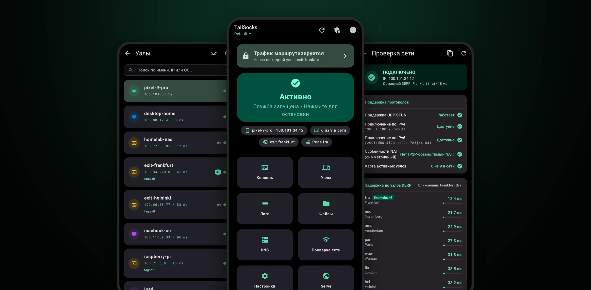
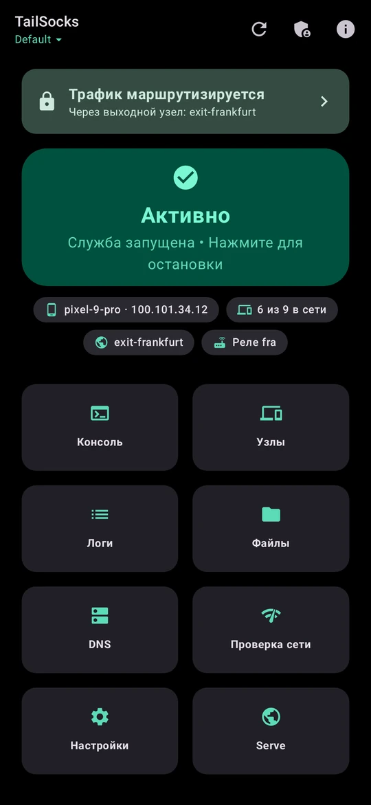
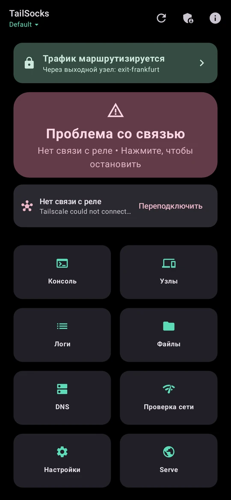
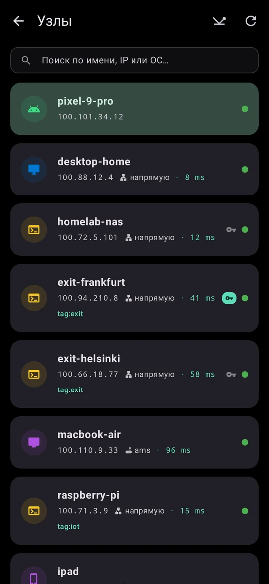
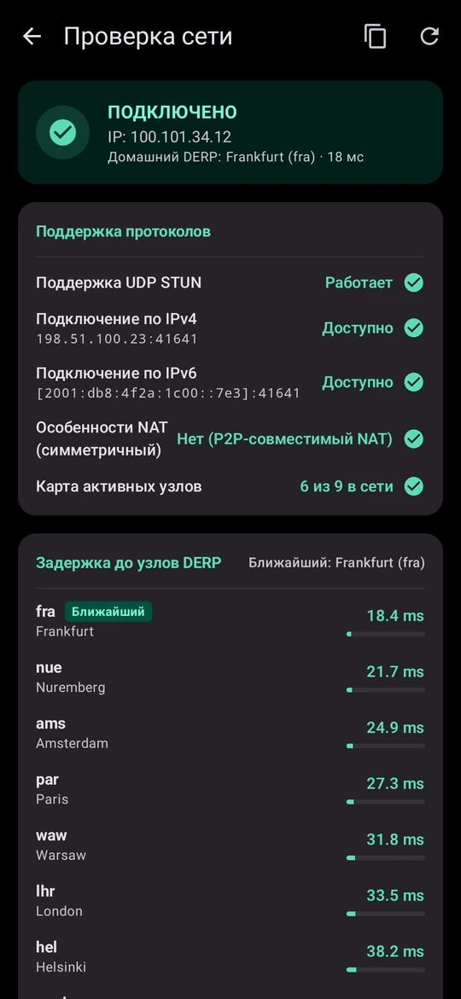
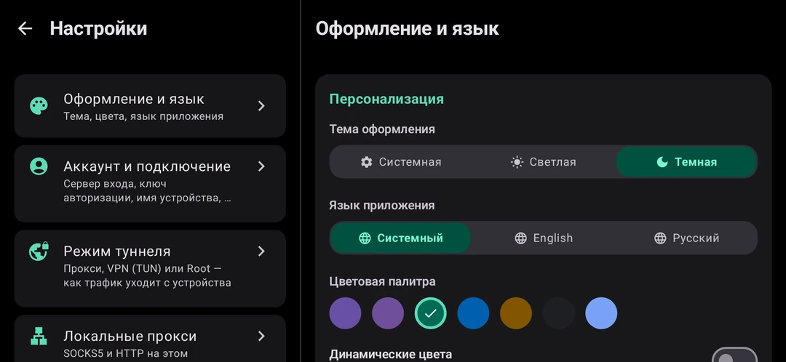

<p align="center">
  
</p>

<h1 align="center">TailSocks</h1>

<p align="center">
  <strong>Неофициальный клиент Tailscale для Android — прокси, VPN или root-маршрутизация</strong>
</p>

<p align="center">
  <a href="readme.md">English</a> | <strong>Русский</strong>
</p>

<table align="center">
  <tr>
    <th>Релиз</th>
    <th>Загрузки</th>
    <th>Ядро Tailscale</th>
    <th>Лицензия</th>
    <th>Перевод</th>
  </tr>
  <tr>
    <td align="center"><a href="https://github.com/bropines/tailsocks/releases/latest"></a></td>
    <td align="center"><a href="https://github.com/bropines/tailsocks/releases"></a></td>
    <td align="center"><a href="https://github.com/tailscale/tailscale/releases/tag/v1.104.0"></a></td>
    <td align="center"><a href="LICENSE"></a></td>
    <td align="center"><a href="https://hosted.weblate.org/engage/tailsocks/"></a></td>
  </tr>
</table>

<table align="center">
  <tr>
    <td align="center"><a href="https://github.com/bropines/tailsocks/releases/latest"></a></td>
    <td align="center"><a href="https://apps.obtainium.imranr.dev/redirect?r=obtainium://add/https://github.com/bropines/tailsocks"></a></td>
  </tr>
  <tr>
    <td align="center"><a href="https://github.com/bropines/tailsocks/releases"></a></td>
    <td align="center"><a href="https://boosty.to/pinus"></a></td>
  </tr>
</table>

<p align="center">
  
</p>

---

TailSocks запускает на Android-телефоне полноценный узел [Tailscale](https://tailscale.com/) и даёт выбрать, как он доступен остальному устройству: как **локальный SOCKS5/HTTP-прокси**, которому не нужно разрешение VPN и который уживается с любым другим VPN; как **системный VPN** (TUN, раздельный или полный туннель); или — на рутованных устройствах — через **настоящий сетевой интерфейс ядра** с policy routing. Всё, что умеет Tailscale, на месте: [выходные узлы](https://tailscale.com/kb/1103/exit-nodes), [MagicDNS](https://tailscale.com/kb/1081/magicdns), [Taildrop™](https://tailscale.com/kb/1106/taildrop), [Taildrive™](https://tailscale.com/kb/1369/taildrive), [Serve & Funnel](https://tailscale.com/kb/1242/tailscale-serve), несколько аккаунтов, Headscale и встроенный обход DPI для управляющего канала там, где Tailscale блокируют.

Приложение говорит, что происходит на самом деле: подключён ли тейлнет, ещё подключается или отрезан от реле, какие ваши устройства доступны напрямую, а какие только через реле, — и предлагает то единственное действие, которое поможет.

---

## ✨ Возможности

### Сеть и Подключение

| Функция | Описание |
|---------|----------|
| **Нативный LocalAPI** | Управление демоном 100% без CLI через Unix-сокет (`tailscaled.sock`) по протоколу LocalAPI v0. Без работы через оболочку. |
| **SOCKS5 Прокси** | Встроенный локальный сервер SOCKS5 с опциональной авторизацией для маршрутизации конкретных приложений. |
| **Доступ из локальной сети** | Один переключатель (Настройки → Локальные прокси → Открыть прокси в локальную сеть) привязывает SOCKS5, HTTP-прокси и локальный DNS к `0.0.0.0`, чтобы другие устройства в вашем Wi-Fi могли ходить через ваш tailnet. Приложение показывает адрес для подключения и предупреждает, если у SOCKS5 нет пароля — без него прокси доступен любому в локальной сети. |
| **Root-режим (экспериментально)** | На рутованных устройствах демон работает от root с настоящим интерфейсом ядра `tailscale0`, policy-routing в таблице `53` через отдельные цепочки iptables `TAILSOCKS_MARK`/`TAILSOCKS_DNS`, исключения приложений, опциональный системный редирект DNS (включается только пока MagicDNS реально отвечает), кнопка диагностики «Проверить маршрутизацию» и вкладка ROOT в логах. Если слот VPN занят другим приложением, Root-режим уступает ему устройство — tailnet остаётся доступен, а чужие приложения и чужой резолвер не трогаются — либо ведёт только те приложения, которые тот клиент пропускает мимо себя; отдельный переключатель всё же забирает устройство. После перезагрузки загрузочный скрипт поднимает только доступность tailnet: выходной узел и системный MagicDNS появляются при следующем запуске приложения. См. [руководство по Root](docs/ROOT_RU.md). |
| **Прокси управляющего сервера** | Маршрутизация трафика к управляющему серверу через кастомный SOCKS5/HTTP прокси для заблокированных регионов. |
| **Режим TUN VPN** | Прозрачный системный VPN через нативную библиотеку `hev-socks5-tunnel` — полный и раздельный туннель, исключение приложений, кастомный IP шлюза. IPv6 внутри tailnet идёт через туннель всегда, а весь остальной IPv6-интернет — только если включить это вручную: выходной узел без IPv6 иначе просто подвешивает такие сайты. Включение TUN теперь спрашивает подтверждение, потому что Android отдаёт слот VPN только одному приложению. |
| **[Exit Nodes](https://tailscale.com/kb/1103/exit-nodes) ©** | Маршрутизация весь интернет-трафик через любой узел сети Tailscale с автовосстановлением и доступом к локальной сети. |
| **[MagicDNS](https://tailscale.com/kb/1081/magicdns) ©** | Разрешение имен узлов в памяти (0мс), Split DNS через SOCKS5 TCP, DoH фолбэк при сбоях. |
| **Обход NAT** | Мониторинг подключения `InMagicSock` в реальном времени. Диагностика STUN/DERP через нативный netcheck. |

### Сервисы и Обмен Файлами

| Функция | Описание |
|---------|----------|
| **[Tailscale Serve & Funnel](https://tailscale.com/kb/1242/tailscale-serve) ©** | Проброс локальных портов в Tailnet или публичный интернет. Режимы TCP и HTTPS, экспорт TLS-сертификатов. |
| **[Виртуальные Сервисы (`svc:`)](https://tailscale.com/kb/1438/virtual-ip) ©** | Создание именованных виртуальных сервисов с выделенными VIP и DNS-именами прямо из нативного UI. |
| **[Taildrop™](https://tailscale.com/kb/1106/taildrop) ©** | Отправка и получение файлов между устройствами Tailnet. Хаб входящих, интеграция с системным меню «Поделиться», DocumentsProvider. |
| **[Taildrive™](https://tailscale.com/kb/1369/taildrive) ©** | Шаринг локальных папок по WebDAV. Интеграция с SAF, монтирование удаленных ресурсов, SOCKS5-проксированный доступ. Исправлена чувствительность к регистру путей. |

### Управление и Администрирование

| Функция | Описание |
|---------|----------|
| **Изоляция Аккаунтов** | Строгое разделение данных каждого профиля — независимые каталоги состояния, настройки, ключи и папки Taildrop. |
| **Tailscale Admin API** | Интеграция с `api.tailscale.com/v2` — управление устройствами, DNS, пользователями, сервисами, вебхуками и логами. |
| **Биометрическая Защита** | Защита консоли администрирования по отпечатку пальца или Face ID. |
| **Ключи Авторизации** | Генерация, просмотр и отзыв Auth Keys прямо из приложения. |
| **Резервное Копирование** | Полный зашифрованный бэкап состояния приложения (ZIP) и экспорт отдельных аккаунтов (JSON). Бэкап записывает версию приложения и формат, которыми был создан; более старое приложение отказывается восстанавливать архив от более новой версии, а не портит профиль (бэкапы старых версий восстанавливаются как прежде). |
| **Автоматизация** | Защищённые токеном Broadcast Intents для Tasker/MacroDroid/ADB и 14 AppFunctions для on-device ассистентов (Gemini, Android 16+). См. [руководство по автоматизации](docs/AUTOMATION_RU.md). |

### Пользовательский Опыт

| Функция | Описание |
|---------|----------|
| **Честный главный экран** | Карточка статуса с шестью состояниями — остановлено, запуск, подключение, подключено, проблема со связью, нужен вход, — баннер, который называет проблему и даёт исправить её одним нажатием (переподключить реле, открыть обход DPI), и сводка тейлнета: это устройство, сколько узлов в сети, выходной узел по имени, домашнее реле. |
| **Адаптивная вёрстка** | Две панели везде, где есть место: горизонтальная ориентация, планшеты, раскладушки (с учётом шарнира, в том числе полураскрытая поза «ноутбуком»); на больших экранах списки и формы держат читаемую ширину. |
| **Дизайн Material 3** | Системная, Светлая, Тёмная и AMOLED Black темы. 7 цветовых пресетов + динамические цвета Material You. |
| **Локализация** | Английский и русский, стандартными строковыми ресурсами Android. |
| **Виджеты Рабочего Стола** | Виджеты Jetpack Glance — Переключатель службы, Выходной узел, Дашборд статистики, Статус Serve. |
| **Плитка Быстрых Настроек** | Плитка в шторке Android с отображением активного профиля и быстрым переключением аккаунтов. |
| **Сетевая Диагностика** | Нативный netcheck с визуализацией задержки DERP-серверов, определением типа NAT и публичного IP. |
| **Надёжность в фоне** | Опциональное автопереподключение с лимитом попыток, 15-минутный watchdog, оживляющий убитую в фоне службу, и wake lock на всю сессию («Держать соединение активным» — он же решает, поднимется ли служба после перезагрузки). Ручная остановка всегда окончательна. См. [Поведение в фоне](#-поведение-в-фоне). |

---

## 📸 Скриншоты

<table>
  <tr>
    <td width="25%" align="center"><br/><sub>Подключено, со сводкой тейлнета</sub></td>
    <td width="25%" align="center"><br/><sub>Что не так — и что поможет</sub></td>
    <td width="25%" align="center"><br/><sub>Узлы с пингом всех разом</sub></td>
    <td width="25%" align="center"><br/><sub>Домашнее реле и задержки DERP</sub></td>
  </tr>
  <tr>
    <td colspan="2" align="center"><br/><sub>Настройки в две панели на широком экране</sub></td>
    <td colspan="2" align="center"><br/><sub>Планшеты и раскладушки — две панели</sub></td>
  </tr>
</table>

<sub>Отрисовано из вымышленного тейлнета собственными превью-тестами приложения — см. <a href="scripts/readme_shots.py"><code>scripts/readme_shots.py</code></a>.</sub>

---

## 🏗️ Архитектура

TailSocks построен как гибридная многослойная система:

```
┌─────────────────────────────────────────────────────────────────┐
│                    Jetpack Compose UI (Kotlin)                  │
│  Dashboard · Peers · Logs · DNS · Netcheck · Serve · Settings   │
│  Admin API Console · Taildrive · Taildrop · TUN Config          │
├─────────────────────────────────────────────────────────────────┤
│                   JNI / Gomobile Bridge (appctr)                │
│  LocalAPI Client · DNS Proxy · IPN Bus · Netcheck · Taildrop    │
├─────────────────────────────────────────────────────────────────┤
│              Tailscale Daemon (libtailscale.so)                 │
│  tsnet · WireGuard · magicsock · DERP · Serve/Funnel · Drive    │
├───────────────────────┬─────────────────────────────────────────┤
│   Режим SOCKS5 Прокси │       Режим TUN VPN (опционально)       │
│  Маршрутизация через  │   Прозрачная системная маршрутизация    │
│  локальный SOCKS5     │   через нативную библиотеку C           │
│  без VpnService       │   hev-socks5-tunnel (полная/раздельная) │
└───────────────────────┴─────────────────────────────────────────┘
```

### Основные Компоненты

| Слой | Технология | Назначение |
|------|-----------|------------|
| **Демон** | Go → `libtailscale.so` (PIE) | Пропатченное ядро Tailscale, собранное с флагами оптимизации для отключения ненужных десктопных функций. Поддерживает `arm64`, `arm`, `x86`, `x86_64`. |
| **Мост** | Go → `appctr.aar` (Gomobile) | Высокоскоростной JNI-мост для вызовов LocalAPI, проксирования DNS, мониторинга шины IPN, netcheck, Taildrop и WebDAV Taildrive. |
| **Приложение** | Kotlin + Jetpack Compose | Пользовательский интерфейс Material 3, управление сервисом, интеграция с Android (SAF, Виджеты, Быстрые настройки, Поделиться). |
| **TUN Движок** | C → `hev-socks5-tunnel` | Опциональный прозрачный VPN-интерфейс. Перенаправляет трафик через SOCKS5-прокси на уровне ядра. Поддерживает исключения приложений и IP. |

### Ключевые Архитектурные Паттерны

- **Stateless Configuration:** Каждое обновление конфигурации явно. Serve/Funnel использует паттерн «Сброс-затем-Применение» (POST `{}` → POST новую конфигурацию) во избежание удержания устаревшего состояния.
- **Пассивное Управление Демоном:** Отсутствие агрессивных циклов опроса. Демон самостоятельно управляет своим жизненным циклом, синхронизацией политик и переподключением.
- **Изоляция Профилей:** Состояние в `files/states/{id}/`, настройки в `appctr_{id}`. Полный перезапуск демона при смене профиля.
- **Обертка DNS:** Разрешение MagicDNS из кэша узлов в памяти. Split DNS обернут как TCP-over-SOCKS5. Цепочка фолбэков: SOCKS5 UDP → Прямой UDP → DoH.
- **Защита от «стены 410»:** Обновления конфигурации блокируются во время активности URL авторизации (Login URL) для защиты сессий входа.

### Патчи Ядра (Upstream Patches)

TailSocks поддерживает 20 минимальных атомарных патчей в директории [`appctr/patches/`](appctr/patches/) для внедрения возможностей, недоступных через стандартный LocalAPI:

| Патч | Назначение |
|------|------------|
| `01-enable-socks-android` | Включение поддержки SOCKS5 в userspace-networking на Android |
| `02-socks5-auth` | Добавление имени пользователя и пароля в исходящий SOCKS5-слушатель |
| `03-taildrop-monolithic-fs` | Файловые операции `fsFileOps` на чистом Go во избежание паник JNI в Taildrop |
| `04-vip-services` | Добавление виртуальных сервисов (VIP) в `HostInfo` для видимости сервером координации |
| `05-localapi-cert` | Включение компиляции эндпоинта `/cert` на Android |
| `06-android-netmon` | Кастомный `netmon.InterfaceGetter` для ограничений `netlink` в Android 10+; маскировка Hostinfo (`OS = linux` по умолчанию, настоящее устройство при «Сообщать настоящую ОС») |
| `07-taildrive-android` | Специфичные для Android адаптации Taildrive |
| `08-netstack-cgnat` | Исправление маршрутизации CGNAT для netstack |
| `09-netstack-loopback` | Loopback-маршрутизация для пакетов, адресованных самому себе в netstack |
| `10-taildrive-userspace-dial` | Маршрутизация WebDAV удаленных пиров через `tsdial.Dialer` |
| `11-noop-dns-fallback` | Внедрение переменной окружения DNS fallback во избежание SERVFAIL |
| `12-socket-permissions` | `tailscaled` сам создаёт сокет доступным для чтения, без внешнего цикла `chmod` |
| `13-android-osrouter` | Роутер для kernel-TUN на Android: только адреса и маршруты, iptables остаются за приложением |
| `14-dns-forwarder-netstack` | Запросы к резолверам внутри tailnet идут через netstack; спасение запроса, на который выходной узел ответил отказом |
| `15-dnscache-static-hosts` | Учёт `TS_STATIC_HOSTS`, чтобы прокси управляющего сервера за именем хоста резолвился |
| `16-android-somark` | Маркировка сокетов root-демона, чтобы их не перехватывал другой VPN-клиент |
| `17-android-tunfd-probe` | Проба: копия TUN-дескриптора VPN передаётся дочернему демону, чтобы узнать, что он с ним может |
| `18-android-vpn-tun` | `--tun=android-vpn`: демон ведёт туннель на дескрипторе, открытом VpnService (нативный движок TUN) |
| `19-android-vpn-netstack` | В этом режиме связь с узлами идёт через netstack, а ответы на собственные соединения демона забирает он |
| `20-socks5-resilience` | Отдаваемый SOCKS5-прокси не падает: пауза при ошибках accept, ограничение на рукопожатие, переживает переподключение реле |

---

## 🚀 Быстрый Старт

### Скачать

Загрузите последний APK со страницы [Релизов](https://github.com/bropines/tailsocks/releases/latest) или используйте кнопки скачивания в начале данного README.

> **Поддерживаемые архитектуры:** `arm64-v8a`, `armeabi-v7a`, `x86`, `x86_64`  
> **Минимальная версия Android:** 7.0 (API 24)

### Сборка из Исходников

<details>
<summary><strong>Инструкция по сборке</strong></summary>

**Требования:**
- Android NDK (установите переменную `ANDROID_NDK_HOME`)
- Go — конкретная версия не нужна: сборка выставляет `GOTOOLCHAIN=auto` и сама скачивает нужный тулчейн Go, который требует модуль
- `gomobile` (`go install golang.org/x/mobile/cmd/gomobile@latest && gomobile init`)
- Android SDK с Gradle

**1. Клонирование репозитория:**
```bash
git clone --recurse-submodules https://github.com/bropines/tailsocks.git
cd tailsocks
```

**2. Компиляция Go-ядра** (скачивает версию Tailscale, указанную в `appctr/TAILSCALE_VERSION`, накладывает патчи и кросс-компилирует):
```bash
cd appctr
bash build.sh
cd ..
```

**3. Сборка APK:**
```bash
# Debug-сборка (ставится рядом с релизом как *.dev, keystore не нужен)
./gradlew app:assembleDebug

# Release-сборка — нужен собственный keystore; сборка отказывается подписывать debug-ключом
KEYSTORE_FILE="$PWD/tailsocks.jks" KEYSTORE_PASSWORD=... \
KEY_ALIAS=... KEY_PASSWORD=... ./gradlew app:assembleRelease
```

> Скрипт сборки автоматически скачивает нужную версию Tailscale, применяет все патчи и компилирует PIE-бинарники для 4 архитектур.
>
> Релизные сборки минифицируются R8 со сжатием ресурсов, а задача `verifyReleaseNativeMethods` роняет сборку, если R8 удалил JNI-метод, нужный TUN-библиотеке. Подробности в [инструкции по сборке](docs/BUILDING_RU.md).

</details>

---

## 📚 Документация

| Документ | Описание |
|----------|----------|
| [Архитектура системы](docs/ARCHITECTURE_RU.md) | Подробный разбор обертки DNS, изоляции аккаунтов, netcheck и патчей |
| [Инструкция по сборке](docs/BUILDING_RU.md) | Настройка NDK, компиляция Go-ядра и конвейер динамических патчей |
| [Ретроспектива проекта](docs/RETROSPECTIVE_RU.md) | Эволюция архитектуры от PoC до текущей версии |
| [Настройка AdGuard](docs/ADGUARD_RU.md) | Сосуществование с системными блокировщиками рекламы |
| [Руководство по Serve & Funnel](docs/SERVE_FUNNEL_GUIDE_RU.md) | Проброс локальных портов и виртуальных сервисов |
| [Root-Интеграция и Системная Служба](docs/ROOT_RU.md) | Автозапуск демона от root, устанавливаемые правила маршрутизации и DNS, сосуществование с другим VPN-клиентом, service.d и CLI-обёртка |
| [Руководство по автосценариям Tasker](docs/AUTOMATION_RU.md) | Интеграция Intents для Tasker, MacroDroid, Automate и ADB |
| [Планы разработки (Roadmap)](docs/ROADMAP_RU.md) | Запланированные функции и ближайшие цели |
| [Как участвовать в разработке](CONTRIBUTING_RU.md) | Сборка, патчи и правила коммитов для первого pull request |
| [Перевод](docs/TRANSLATING_RU.md) | Перевести приложение в браузере на Hosted Weblate |
| [История изменений](CHANGELOG.md) | Полный журнал версий |

---

## 🌐 Обход Блокировок и DPI (ByeDPI)

Для пользователей из регионов с ограничениями (где `controlplane.tailscale.com` блокируется или сбрасывается), TailSocks предлагает встроенный механизм обхода блокировок сервера координации:

### Обход DPI управляющего сервера (ByeDPI JNI)
TailSocks включает нативную JNI-реализацию [ByeDPI](https://github.com/hufrea/byedpi) непосредственно внутри процесса приложения. Это позволяет обходить аналитическую проверку пакетов по SNI (DPI) без запуска внешних бинарных процессов.
* **Безопасность:** ByeDPI при каждом запуске привязывается к случайному loopback IP (например, `127.182.201.43`) и случайному порту в подсети `127.0.0.0/8`. Это защищает прокси от обнаружения другими приложениями через сканирование портов.
* **Использование:** Включите **Обход DPI (ByeDPI)** в Настройки → Обход блокировок и настройте кастомные флаги ByeDPI (по умолчанию: `-s 1 -d split -r`).

---

## ⚡ Интеграция с Tasker и Автосценариями

TailSocks поддерживает фоновое управление через **Android Broadcast Intents**. Вы можете автоматизировать подключение с помощью Tasker, MacroDroid, Automate или `adb`.

**Секретный токен обязателен.** Задайте его в **Настройки → Автоматизация и API** (есть кнопка *Сгенерировать*) и передавайте с каждым intent строковым extra `secret` (принимаются также `token` и `key`). С версии 4.0.0 receiver игнорирует все intent-запросы, пока токен не задан, поэтому никакое другое приложение на устройстве не сможет остановить ваш VPN или перенаправить трафик.

* **Целевой Receiver:** `io.github.bropines.tailscaled/.core.TaskerReceiver` (пакет `io.github.bropines.tailscaled`)
* **Поддерживаемые действия (Actions)** (у каждого есть короткий псевдоним, например `io.github.bropines.tailscaled.START`):
  * `io.github.bropines.tailscaled.action.CONNECT` / `DISCONNECT` / `TOGGLE` / `RESTART` — управление подключением
  * `io.github.bropines.tailscaled.action.GET_STATUS` — обновляет состояние виджетов/плитки (broadcast `STATUS_CHANGED` не виден другим приложениям)
  * `io.github.bropines.tailscaled.action.SET_EXIT_NODE` — extra `exit_node` (IP или `none` для сброса)
  * `io.github.bropines.tailscaled.action.SWITCH_ACCOUNT` — extra `account` (имя или ID профиля)
  * `io.github.bropines.tailscaled.action.SET_BYEDPI` — extras `enabled` (boolean), `flags` (string)
  * `io.github.bropines.tailscaled.action.SET_TUN` — extra `enabled` (boolean)

#### Пример ADB
```bash
adb shell am broadcast -a io.github.bropines.tailscaled.action.DISCONNECT -n io.github.bropines.tailscaled/.core.TaskerReceiver --es secret YOUR_TOKEN
```

#### Пример настройки в Tasker:
1. Действие: **Система** → **Отправить Intent**
2. Action: `io.github.bropines.tailscaled.action.CONNECT`
3. Категория: **Broadcast Receiver**
4. Пакет: `io.github.bropines.tailscaled`, Класс: `io.github.bropines.tailscaled.core.TaskerReceiver`
5. Extra: `secret:YOUR_TOKEN`

Полный справочник — все действия, их extras, broadcast статуса и список AppFunctions — в [руководстве по Tasker и автоматизации](docs/AUTOMATION_RU.md).

### 🤖 Gemini / AppFunctions (Android 16+)

На Android 16 и новее TailSocks предоставляет on-device ассистентам **14 AppFunctions**: `getStatus`, `getAvailableExitNodes`, `getTailnetPeers`, `getAccounts`, `connect`, `disconnect`, `toggle`, `selectExitNode`, `clearExitNode`, `switchAccount`, `setByeDpi`, `setTunMode`, `setAllowLanAccess`, `setMagicDns`. Каждая функция, меняющая состояние, подчиняется переключателю «Разрешить внешнюю автоматизацию»; read-only функции отвечают всегда.

---

## 🔄 Поведение в фоне

* **Автопереподключение** (Настройки → Работа в фоне и разрешения, по умолчанию выключено) перезапускает демон, если соединение не поднимается или обрывается, с настраиваемым лимитом попыток. Ожидание входа пользователя сбоем не считается.
* **Восстанавливать службу в фоне** (там же, по умолчанию включено) раз в 15 минут проверяет, что служба жива, и запускает её снова после убийства в фоне. Разрешение «Будильники и напоминания» (приложение попросит его при включении переключателя) позволяет проверке поднять службу из фона; без него проверка тоже работает, просто срабатывает позже. Если прошивка всё равно откажет в запуске, придёт уведомление, которое подключает в одно нажатие, а приложение один раз подскажет, где включить автозапуск.
* **Держать соединение активным** (Настройки → Работа в фоне и разрешения, по умолчанию выключено) держит wake lock на всю сессию, чтобы соединение переживало глубокий сон, и именно он поднимает службу после перезагрузки. Расходует батарею. В Root-режиме от него зависит, как быстро после перезагрузки вернутся выходной узел и системный MagicDNS: если он выключен — только когда вы откроете приложение.
* **Ручная остановка окончательна.** Остановка из приложения, уведомления, плитки быстрых настроек, intent `DISCONNECT` или AppFunction `disconnect` сначала сбрасывает желаемое состояние; ни watchdog, ни автопереподключение, ни sticky-перезапуск Android не вернут службу, пока вы не запустите её снова.
* **Смахивание приложения сохраняет соединение.** Удаление задачи из «Недавних» не останавливает службу.

---

## 🤝 Благодарности

| | |
|-|-|
| **Приложение и Патчи** | [Bropines](https://github.com/bropines) — разработка приложения, архитектура и большинство патчей ядра |
| **Первичные Android-патчи** | [Asutorufa](https://github.com/Asutorufa) — оригинальные [патчи](https://github.com/Asutorufa/tailscale) сети (`anet`) и мониторинга (`netmon`), послужившие отправной точкой |
| **Обход DPI** | [hufrea/byedpi](https://github.com/hufrea/byedpi) — утилита обхода DPI через локальный HTTP/SOCKS5 прокси |
| **TUN Движок** | [heiher/hev-socks5-tunnel](https://github.com/heiher/hev-socks5-tunnel) — нативная библиотека трансляции SOCKS5 в TUN-интерфейс |
| **Ядро Tailscale** | [Tailscale Inc.](https://github.com/tailscale/tailscale) — сетевой движок в пользовательском пространстве (`tsnet`) |
| **ИИ Помощник** | [Google Gemini](https://gemini.google.com/) — разработка интерфейса, исследование LocalAPI и проектирование патчей |
| **ИИ Помощник** | [Claude](https://claude.com/claude-code) от Anthropic, в Claude Code — исправления демона и моста (вход, реакция на смену сети, падения на Android 10), адаптивная вёрстка, скриншоты-превью без устройства и исследование каналов распространения |

---

## 📜 Лицензия

Распространяется под лицензией **BSD 3-Clause License**. Смотрите [`LICENSE`](LICENSE) для подробностей.

*Tailscale, Taildrop, Taildrive, MagicDNS и Funnel являются товарными знаками Tailscale Inc. Этот проект является независимой разработкой с открытым исходным кодом и не связан с Tailscale Inc.*
